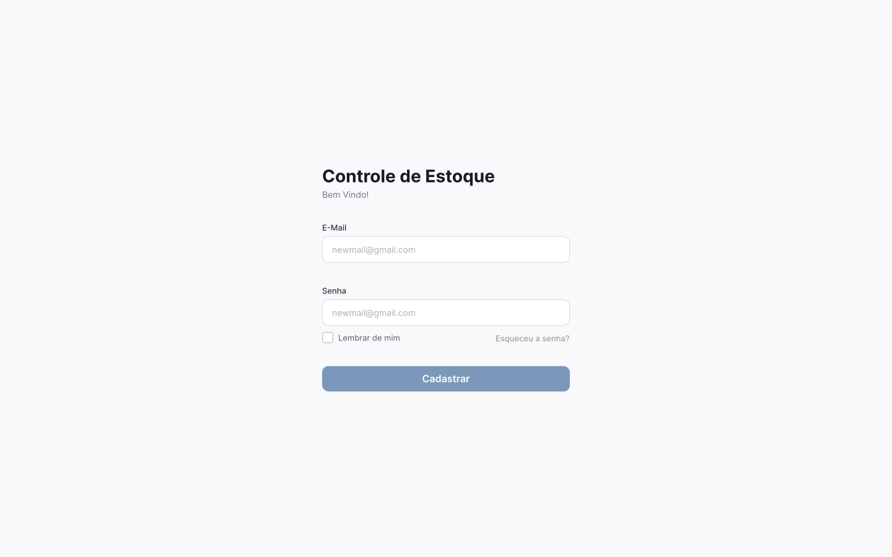
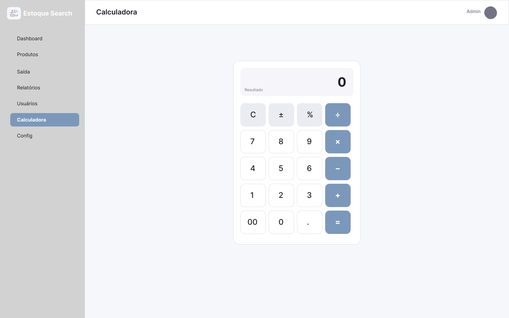
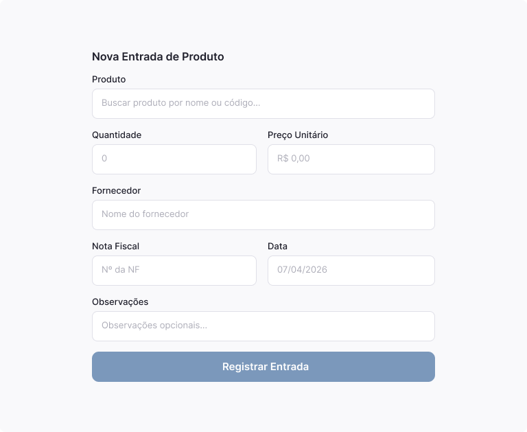
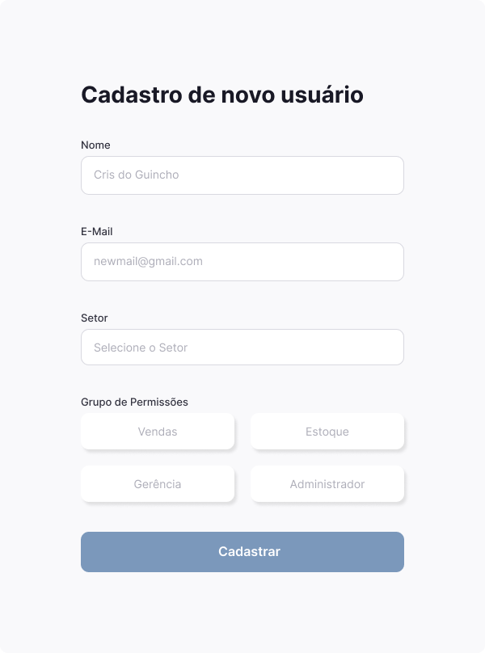
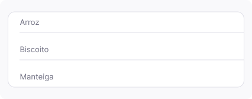
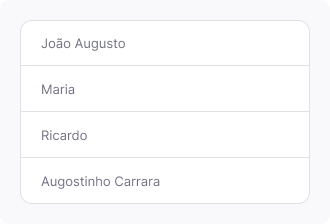
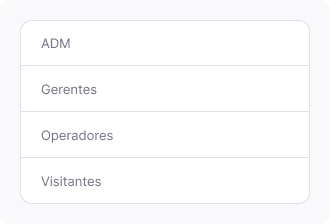
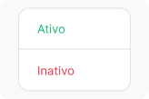

# Projeto de Interface

Visão geral da interação do usuário pelas telas do sistema e protótipo interativo das telas com as funcionalidades que fazem parte do sistema (wireframes).

 Apresente as principais interfaces da plataforma. Discuta como ela foi elaborada de forma a atender os requisitos funcionais, não funcionais e histórias de usuário abordados nas <a href="2-Especificação do Projeto.md"> Documentação de Especificação</a>.

## User Flow

Fluxo de usuário (User Flow) é uma técnica que permite ao desenvolvedor mapear todo fluxo de telas do site ou app. Essa técnica funciona para alinhar os caminhos e as possíveis ações que o usuário pode fazer junto com os membros de sua equipe.

> **Links Úteis**:
> - [User Flow: O Quê É e Como Fazer?](https://medium.com/7bits/fluxo-de-usu%C3%A1rio-user-flow-o-que-%C3%A9-como-fazer-79d965872534)
> - [User Flow vs Site Maps](http://designr.com.br/sitemap-e-user-flow-quais-as-diferencas-e-quando-usar-cada-um/)
> - [Top 25 User Flow Tools & Templates for Smooth](https://www.mockplus.com/blog/post/user-flow-tools)

## Wireframes

---

### Tela - Login

A tela de login apresenta os campos de autenticação do usuário.

<figure>
  <figcaption>Figura 1 - Tela de Login</figcaption>
</figure>

### Tela - Dashboard

Apresenta uma visão geral com indicadores e navegação principal do sistema.

<figure>
  <figcaption>Figura 2 - Dashboard</figcaption>
</figure>

### Tela - Produtos

Lista de produtos cadastrados no sistema.

<figure>
  <figcaption>Figura 3 - Tela de Produtos</figcaption>
</figure>

### Tela - Saída de Produtos

Controle de saída/movimentação de produtos.

<figure>
  <figcaption>Figura 4 - Saída de Produtos</figcaption>
</figure>

### Tela - Relatórios

Visualização de relatórios e análises.

<figure>
  <figcaption>Figura 5 - Relatórios</figcaption>
</figure>

### Tela - Usuários

Gerenciamento de usuários do sistema.

<figure>
  <figcaption>Figura 6 - Usuários</figcaption>
</figure>

### Tela - Calculadora

Ferramenta auxiliar para cálculos dentro do sistema.

<figure>
  <figcaption>Figura 7 - Calculadora</figcaption>
</figure>

### Tela - Configurações

Configurações gerais do sistema.

<figure>
  <figcaption>Figura 8 - Configurações</figcaption>
</figure>

### Tela - Cadastro de Produtos

Formulário para cadastro de novos produtos.

<figure>
  <figcaption>Figura 9 - Cadastro de Produtos</figcaption>
</figure>

### Tela - Cadastro de Usuários

Formulário para cadastro de usuários.

<figure>
  <figcaption>Figura 10 - Cadastro de Usuários</figcaption>
</figure>

### <b>Tela – Box de Busca de Produtos</b>

Componente de busca que permite localizar produtos cadastrados no sistema.

<figure>
  <figcaption>Figura 11 - Box de Busca de Produtos</figcaption>
</figure>

### <b>Tela – Box de Busca de Usuários</b>

Componente de busca utilizado para localizar usuários cadastrados.

<figure>
  <figcaption>Figura 12 - Box de Busca de Usuários</figcaption>
</figure>

### <b>Tela – Seletor de Grupos</b>

Componente responsável pela seleção de grupos/perfis de usuários no sistema.

<figure>
  <figcaption>Figura 13 - Seletor de Grupos</figcaption>
</figure>

### <b>Tela – Seletor de Status de Usuários</b>

Componente que apresenta os status disponíveis para usuários (ex: ativo, inativo, etc.).

<figure>
  <figcaption>Figura 14 - Status de Usuários</figcaption>
</figure>

## Protótipo de baixa fidelidade

As telas do sistema possuem uma padronização abordada na figura 1 e figura 2 onde a primeira é a tela de usuário e a segunda é o padrão de organização do site. Sendo assim, divididas em o conteúdo central a tela de usuário e a tela padrão possui uma sidebar a esquerda e o conteúdo a direita.

A tela inicial possui o conteúdo centralizado, onde é feito o login ou o cadastro de usuário.

Figura 1 - Tela de login 

A tela padrão após o login consiste em:

<ul>
<li>Sidebar: Navegação e Orientação entre as opções</li>
<li>Cabeçalho: Local onde aparece o titulo da pargina abordada e o perfil do usuário</li>
<li>Conteúdo: Local onde ocorre a apresentação das informações requeridas pelo usuário</li>
</ul>

Figura 2 - Organização Padrão do site

 
> **Links Úteis**:
> - [Protótipos vs Wireframes](https://www.nngroup.com/videos/prototypes-vs-wireframes-ux-projects/)
> - [Ferramentas de Wireframes](https://rockcontent.com/blog/wireframes/)
> - [MarvelApp](https://marvelapp.com/developers/documentation/tutorials/)
> - [Figma](https://www.figma.com/)
> - [Adobe XD](https://www.adobe.com/br/products/xd.html#scroll)
> - [Axure](https://www.axure.com/edu) (Licença Educacional)
> - [InvisionApp](https://www.invisionapp.com/) (Licença Educacional)
